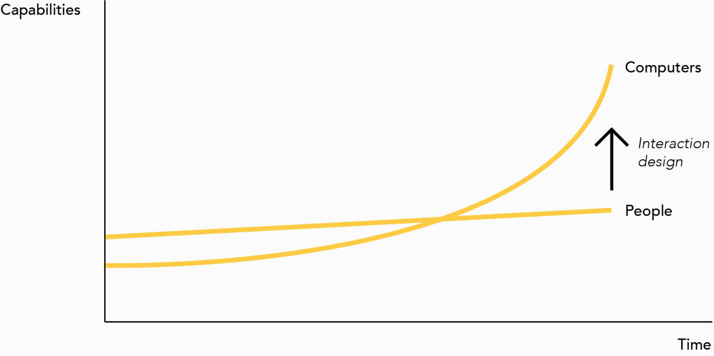
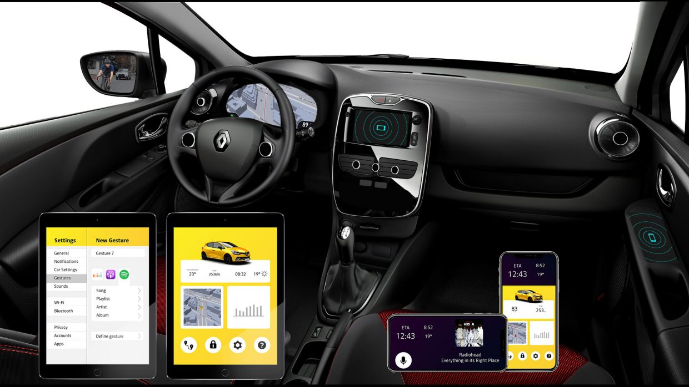

I wrote an in-depth article on my blog with more details about the concept [here](https://theturnsignalblog.com/blog/newconceptfordriverdistraction)

##Problem
During my internship at the design department of Renault in Paris, I carried out this project as part of my master’s thesis. I tried to answer the question: if it was possible to design the interactions between a person and a car from scratch today, how could they be designed?

##Research
The research showed that even though more and more technologies are added to the car each year, the interaction model has stayed largely the same. As a result, cars have become complex to operate; technology companies are offering replacement systems, users find substitute devices, or only ever use the basic features of the car. Today, there is an opportunity to explore different technologies to see if this interaction model can be improved.

Considering this, I explored new interaction models. Building on academic research, I designed a broad concept, consisting of three parts, to show a new way of interaction with the car using existing technologies.

##Proposed Solution
First, a new way of interacting between the driver and the cluster using gesture interaction is presented. Drivers can input gestures with their thumbs using touchpads. This has numerous advantages. First, users never look down further than the cluster screen because the touchpads don’t display anything. Second, the interaction model is very similar to touch interfaces on smartphones and tablets which users are used to. Last, custom gestures can be set up to perform an interaction that would otherwise require numerous actions.
The main problem with this concept is discoverability: how do users discover how to use the system? This was tested with a prototype.

[Check out the initial concept on Youtube](https://www.youtube.com/embed/IyKkf29e39Q)

The second part describes why and how the car can be designed around the smartphone. Generally, people are only used to one or two operating systems: a mobile operating system and Windows or macOS. However, in a car, they are presented with a totally new operating system which they either don’t want to learn or don’t have the capabilities to learn. By moving all the complicated interactions out of the car and to the smartphone, the information will be presented in a system that the users understand.

The last part focuses on the feedback from the car and how this can be made more natural. In a car, the main way of providing feedback to the driver is via warning lights and beeps. There is not a single example in nature where humans get feedback from beeps and warning lights. A common example is when driving too close to the car in front, the car might show a warning light and drivers will be informed via a beep. At that point, they do not know whether the car beeps at them because of their seatbelt, because the lights are on, because a door is open, etc. The drivers are alerted by an unexpected, unidentifiable beep. They then have to divert their attention to the cluster where a warning light tells them that they are too close to the car in front. They then have to look up again and change their driving behavior. Instead, using more modalities can reduce the cognitive load of the driver. In a situation where someone is driving to close to the car in front, the car can communicate that it is ‘uncomfortable’ by pushing back the gas pedal, by making the seat a bit harder, or by making the steering lighter. Also, the attention of the driver can be directed to the danger in question by using screens instead of mirrors and via head-up displays.

##User Test
A user test was conducted to test the discoverability of the gesture interaction on the steering wheel. An interactive prototype was created using JavaScript and an iPad Pro was used to display the system. 14 participants were asked to perform several tasks.
The test results showed that when users are presented with clear instructions, the discoverability is not a problem.
Interesting next tests would be to research the usability in a driving environment, and how the usability changes if people use the system for longer periods.

[Check out the video of the final prototype](https://www.youtube.com/watch?v=FXgWM8VarwM)

[Read the full report here](https://github.com/casperkessels/PortfolioV4/blob/master/content/blog/1_Renault/Thesis_CasperKessels.pdf)
