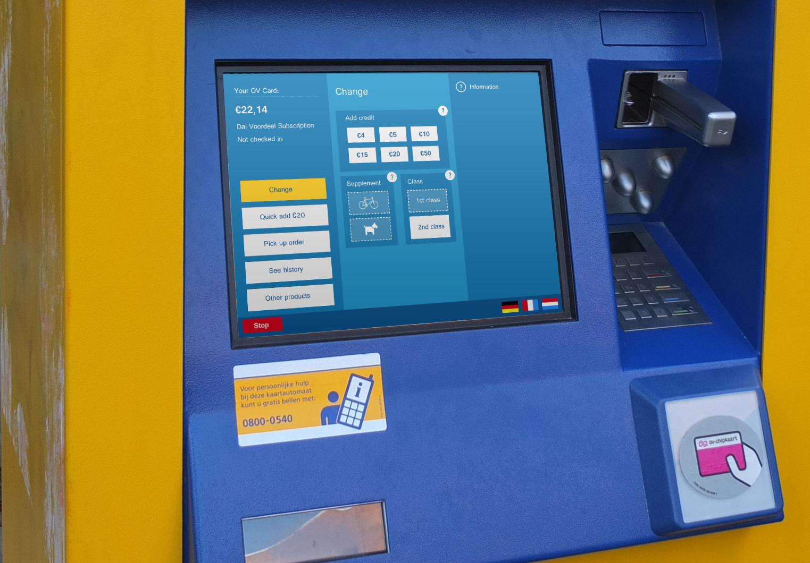

I recently came back to the Netherlands after living abroad for a year. Upon my return, I was confronted with the NS ticket machine again. Generally, the digital products of NS look great, but the ticket machines at the railway station are a big exception. For me as an experienced user, they work fine, but the problem is that I don’t like using them. The interface is very utilitarian and looks outdated. Also, now that I am living in a touristic area, I often see people struggle with it. Therefore, last week I used my spare time to see if I could improve the user experience of the system in a 5-day design sprint.

I wrote an article on Medium that describes the entire design process and final results.
[Check out the article here](https://blog.usejournal.com/improving-the-user-experience-of-the-ns-ticket-machines-825f751f6ace)

