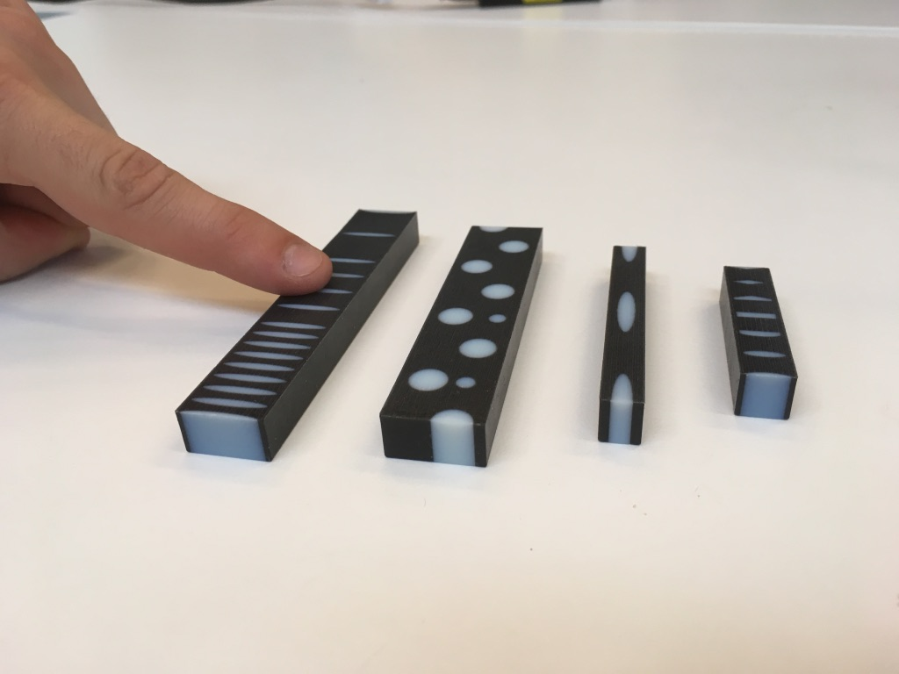

Fore more detailed information, have a look at the report or at [our paper](https://dl.acm.org/citation.cfm?id=3301164).

##Problem

Haptic feedback is the use of the sense of touch in a user interface design to provide information to an end user. Currently, the only mainstream way of providing haptic feedback is via vibration (think of your smartphone or gamecontrollers). The goal of this project was 1) to come up with a new way of giving haptic feedback, 2) to define a suitable application area for the technology and 3) to test it with users.

Together with 4 other students, I worked on this for 5 months. The end results is a 3D printed technology that can simulate different textures through different levels of compression.

##Research

To get to this result, several weeks of thorough research and brainstorming were necessary to explore the entire field of haptics, current technologies and opportunities for the future. In the end we settled on the field of virtual reality. VR is completely immersive, until you try to touch a virtual object. The realism of the scene diminishes when you see your hand go through an object where you expect to feel the characteristics.

###First test: what dimensions can users clearly distinguish
We did user tests to research what kind of dimensions users can feel. This resulted in 3 main dimensions: hard vs soft textures, smooth vs rough textures and warm vs cold textures. Based on these dimensions, we set out to create a prototype that could replicate the different dimensions. However, we needed a specific scenario to test our prototype. After more brainstorming sessions, a scenario of a dinosaur museum was chosen because this scenario has a lot of potential for real use and it adds a lot to the experience because most people have not experienced what it is like to touch the texture of a dinosaur.

The technology we created consists of a 3D print with two different kind of materials. One soft material (black) and one hard material (blue). By compressing the print, the soft material bends over the edges of the hard material creating a bumpy surface. The higher the compression, the higher the bumps.

###Second test: accuracy of the first prototype
The second user tests were conducted to test how accurate the prototype could mimic textures and to see how big the influence of visuals are on the perceived realism of the prototype. By putting a texture on a virtual cube without any context, the realism of the protoype could be tested. And by showing the same texture on a cube and a dinosaur (without informing the participant), the influence of the visual experience could be tested. For these tests, the hydraulic compression system was created with the help of lasercutters.

UNADJUSTEDNONRAW_thumb_9288systemmodel

##Final Prototype
For our final system evaluation experiment we tested the prototype both in a congruent and incongruent condition. In the congruent condition, the compression of the prototype matched the texture of the dinosaur, in the incongruent condition, they are different. The findings show that participants can correctly identify the visual and haptic feedback in the congruent condition, while in the incongruent condition people seem to answer more randomly and negative. However participants in the congruent condition do not consider the overall experience of the system better – meaning that the haptic device does influence their perception, but more indirectly after they experienced the three different textures. Nonetheless, overall people liked the experience with the prototype a lot and considered touching virtual objects in this context certainly as an additional value to the field of virtual reality.

##My Role

