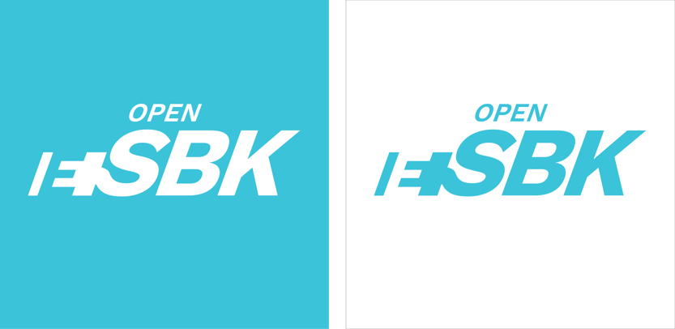
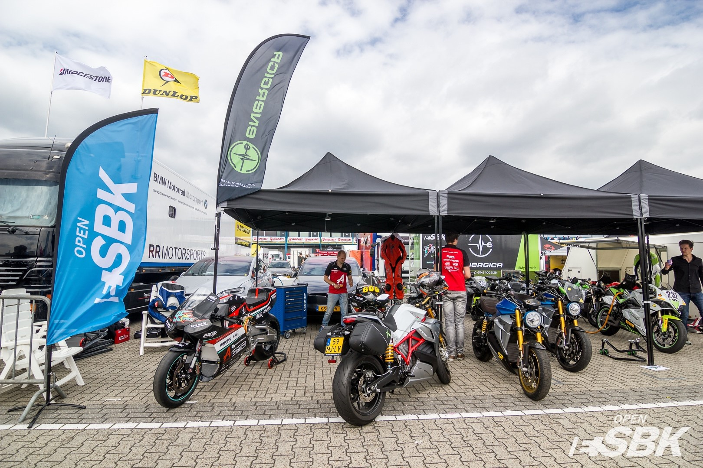
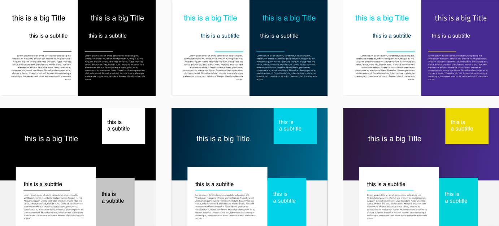
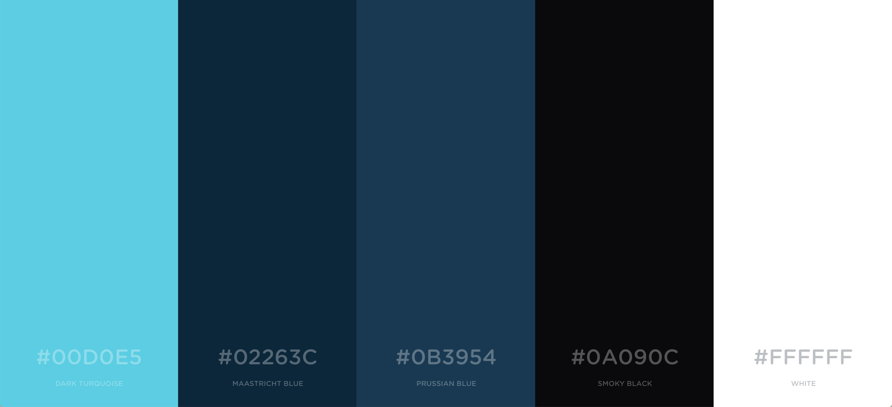
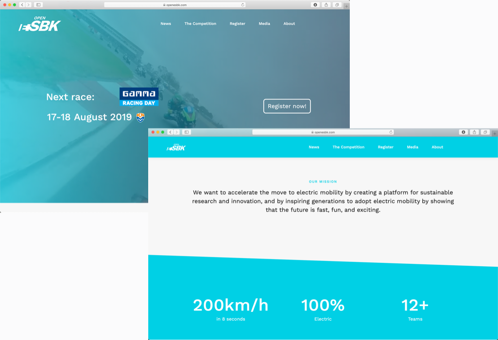
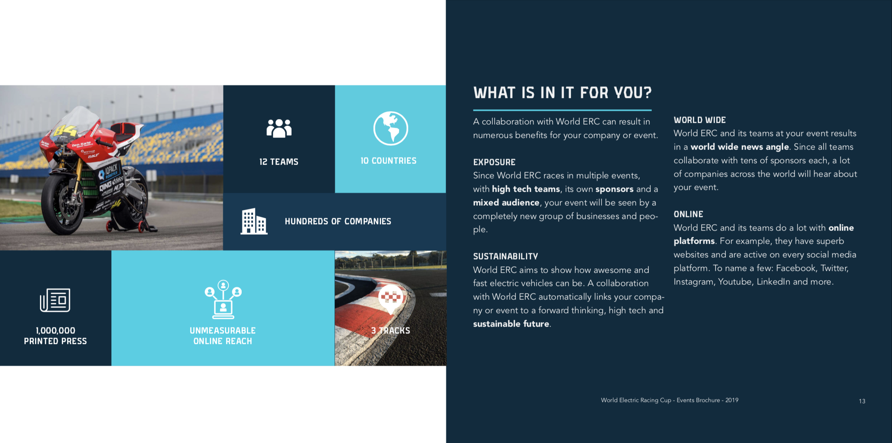
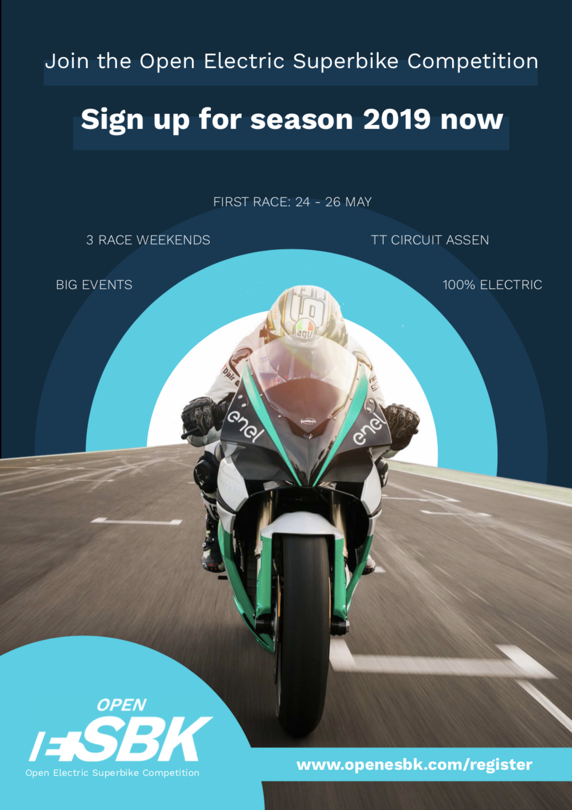
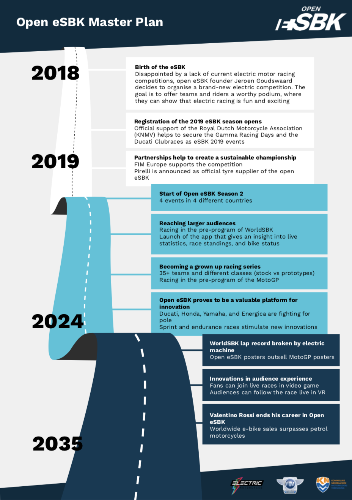

Since the start of 2019, together with 5 friends, we have been starting up a fully electric motorcycle racing competition.
Our mission is to accelerate the development of electric mobility. We want to achieve that by creating a platform for sustainable research and innovation. And at the same time by inspiring people to adopt electric mobility by showing that it is fast, fun, and exciting. So far, we have organized one pilot and one real race during an event with 80,000 spectators at the world famous TT Circuit Assen.

##Problem
An important part of the competition is its outside communication. As it is a brand new competition, we had to come up with a name, brand, website and other marketing materials. The most important requirement is that the two values of innovation and excitement are reflected by the brand identity. So we set out to create a branding around this.

##Name
First the name. We believe the core principle of our competition is that it is open. By limiting the technical restrictions, we allow participating teams to truly innovate in the field of electric mobility to become faster than the competitors.
Also, we  want to give it the same appeal as any other established racing competition so from just hearing the name, it has to sound like well established competition.
Last, it has to be very easy to remember and it should not infringe or be close to other brand names.

We settled on Open Electric Superbike Competition.

##Logo
After creating the name, it was time to create a logo. I first looked at similar organisations like Formula e and other electric & non-electric racing competitions. I then looked at the context in which the designs would be used which is very broad, from big physical prints, to small logos on videos.

I concluded that the logo had to be very simple and self explanatory. Also there is no room for colors due to the broad applications. Naturally, it should be clear from the logo what it represents.

Electric and innovation are represented by a bright blue color.

##Color scheme
I chose to use a bright blue shade as only primary color as it represents innovation and electricity.

##Website
The website is very important as it is the main means of communication and marketing next to social media. Especially considering most other small competitions do not have a great online representation. It is a great opportunity to show how innovative and cool the open electric superbike competition is.

##Marketing materials
We can differentiate ourselves from other racing competitions by attractive well-designed communication materials. These are some examples I created for print.
###Brochure

###Flyer

###Timeline
