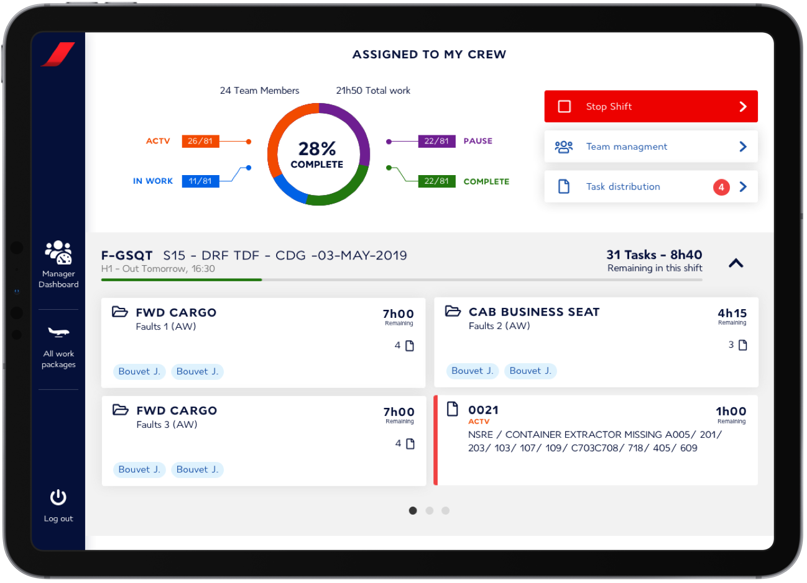

#Problem
I worked on this project while I was an interaction designer at Mirabeau, a digital agency based in the Netherlands.  Mirabeau does a lot of work for airlines, one of which is Air France - KLM.
Aircraft mainentence mechanics at Air France were working mostly on paper and using a very complex software program for administration. This was costing a huge amount of paper, and the administration also took a long time because the software was too complex. Every mechanic was given an iPad but still, there was nothing that was specially designed for them to allow them to work digitally. So the goal of the project was to come up with a digital tool called EVA to increase efficiency, employee happiness, and quality of work.

Before I joined the project, a 6-week get-ready phase was took place during which a lot of user research was done to map the entire work flow and user journey. Also, a quick prototype was created to visualise the results of this research.
I joined right after this was done and my task was to take the prototype and turn it into a solid MVP in 7 months.

#Process
The development was handled by KLM. We worked with one scrum team that was based at the KLM maintenance hangars at Schiphol Airport. The design team consisted of an interaction designer (me) and a visual designer.

Because of the big focus on usability, and the highly technical knowledge and complexity of the process, it was important to do regular user tests. We worked screen by screen, so for each big screen I gathered the necessary base knowledge to create a prototype in Axure. I then tested it with mechanics in the hangars of Air France in Paris. Based on the results, I did another iteration if necessary. If that was not necessary, I worked together with the visual designer and developers to make the feature ready for production.
Then, after finishing an entire user flow consisting of multiple screens, we went to the airport to test this in context.

#Challenge
The project was a big challenge from an interaction design perspective. How can you take the entire workflow of mechanics and turn it into a digital app, taking into account the higher flexibility that paper has over digital, and the openness to change of the users who have been working in a certain way for years and are now forced to change.

The biggest challenge in that regard was in aligning all the different processes of the mechanic. Air France has multiple hangars in multiple air ports. And in each hangar there is different maintenance work and teams working in different ways. All of these teams had to use the app and therefore, work in roughly the same way. Next to that, there are very strict regulations around the work so I was often limited in what the design could do. The way I approached this is by doing as many user tests as possible. These tests really help to improve the usability of the app, but also to meet the mechanics, show them what we are working on, and gain buy-in from them. Next to that, I worked together with stakeholders who were in charge of process related changes by creating prototypes and visuals that helped in communicating our vision and showing the benefits.

The prototype was created without any technical constraints and without looking too much into the future. So next to developing all the features, it was also a challenge to lay out a framework that would allow the app to grow and stay usable. Coming up with such a framework from the start is very difficult so at the start, I first developed screens based on the prototype. When I gathered enough knowledge about the project, I worked on this framework and slowly introduced it into the design. This gradual process made sure that we did not delay the project too much and satisfied all stakeholders.

The last challenge was the fact that the developers were working in the Ionic framework. This limited the freedom of the design by quite a bit since we mostly had to use the components that were offered by Ionic.

