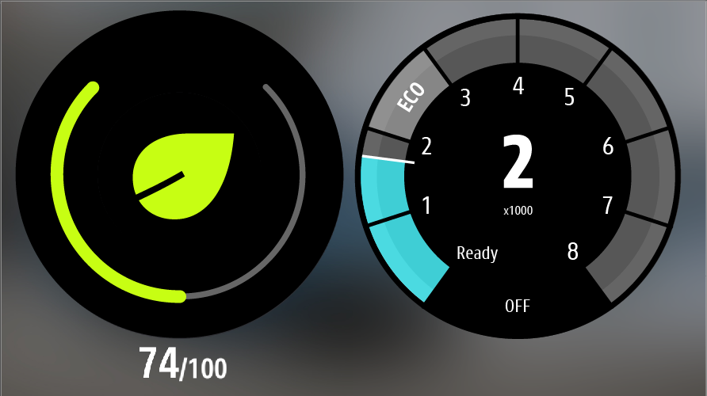
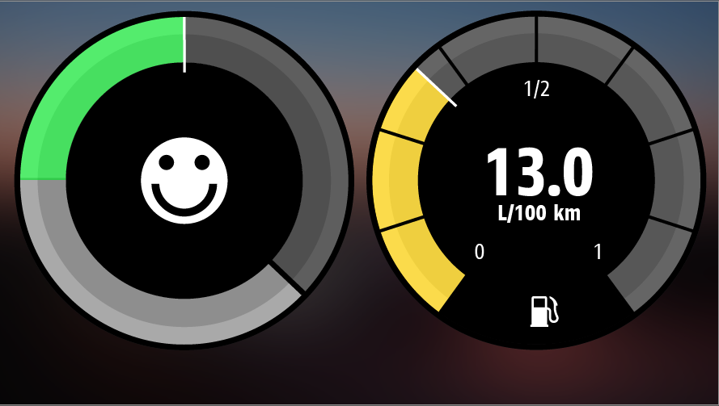
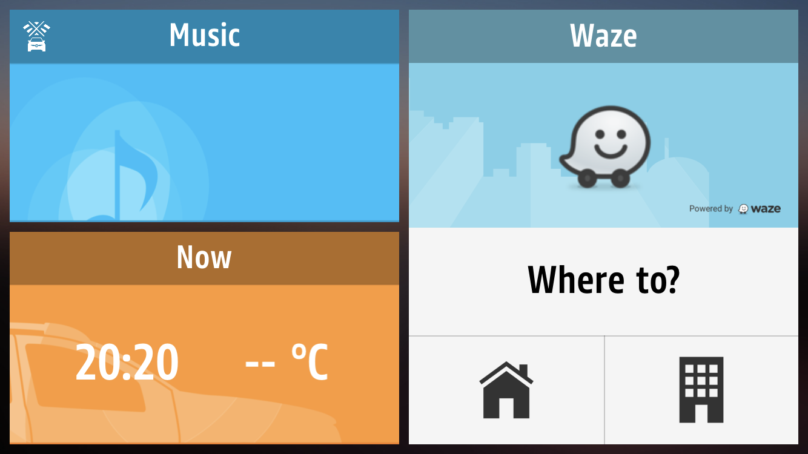

 As part of my internship at the design department of Groupe Renault, I worked on a UI update of the R&GO app. This app is developed for people who bought a model of Renault without a large center screen. For these customers, Renault offers the R&GO app for smartphones. This app can connect to the car's computer and can thus offer the benefits of the smartphone apps combined with data from the car. Drivers can access their favorite media apps and information about their driving statistics all from the same app.

 As part of a UI update, I worked on a new version of the different dials for RPM, eco driving, fuel level, and oil & water temperature. Next to that, I designed widgets that can be added to the app dashboard and configured by the user.

 The most important part of this update was the new RPM gauge. To research this, I looked at reviews from the different app stores to see if and what the different comments are on the RPM gauge. This showed that the design was not readable enough for users and that some information was missing, like the exact RPM number and current gear.

 In the final design, I processed this feedback by prioritizing color over numbers to improve readability. But as more accurate information was requested by the users, instead of adding the precise number, I added the big steps of the RPM and a big number for the current gear in the middle.

 
 
 
 
