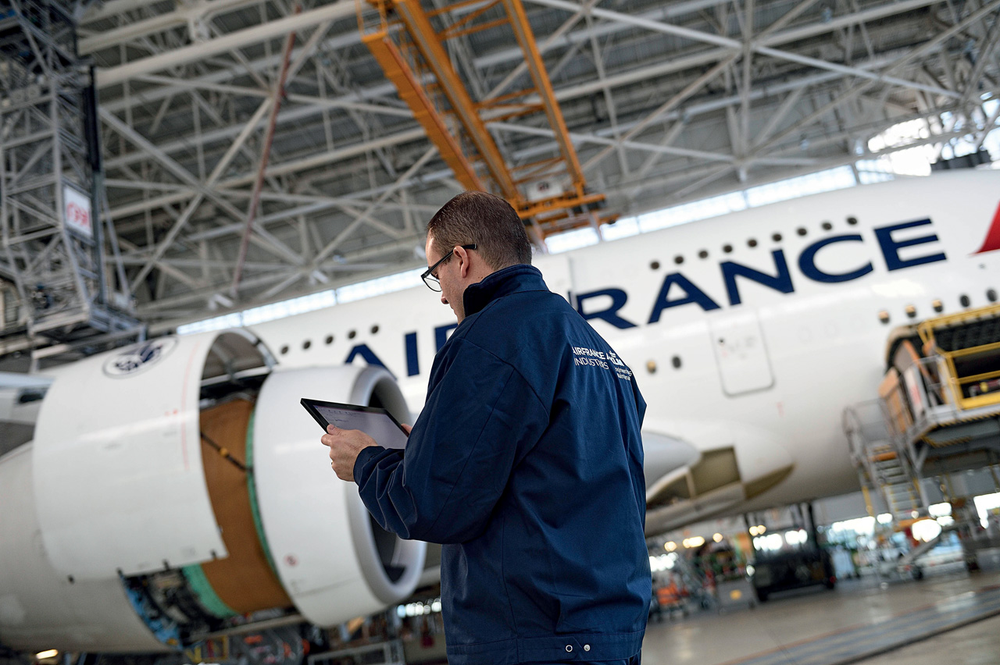
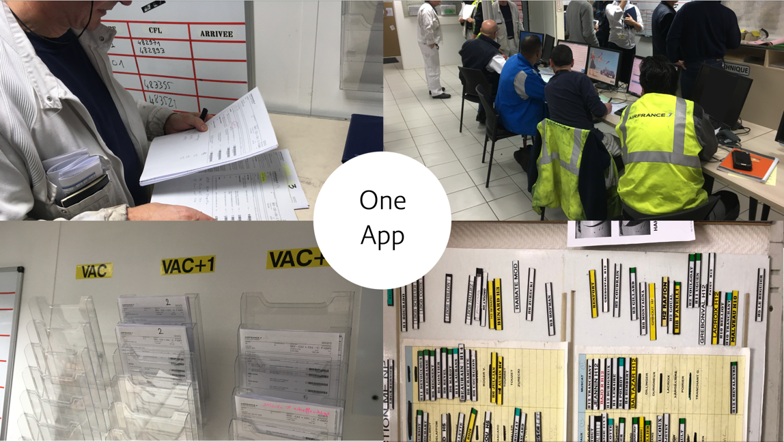
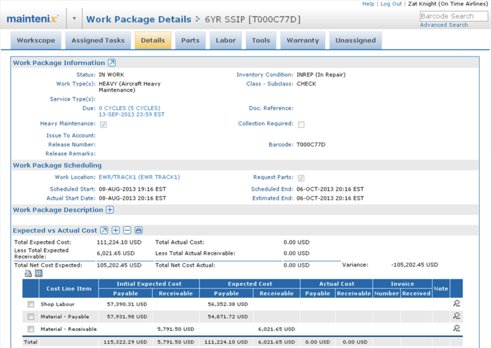
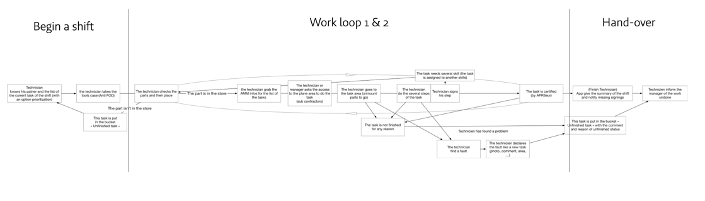
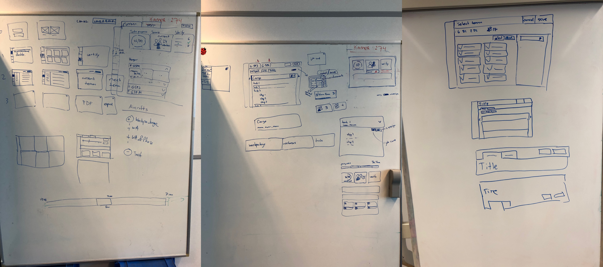
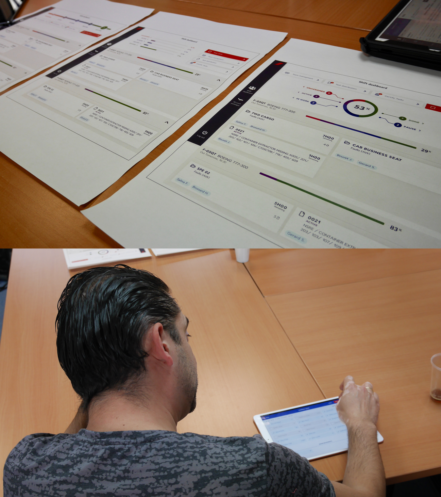
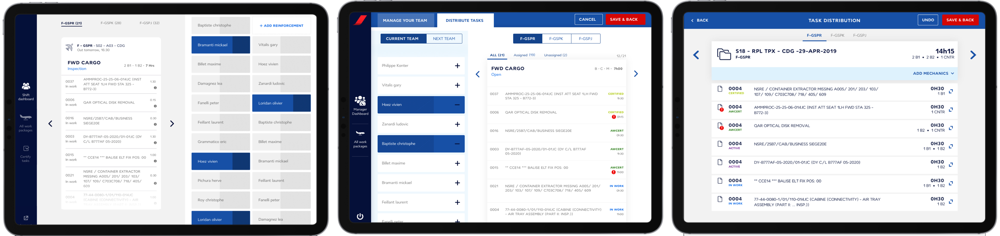
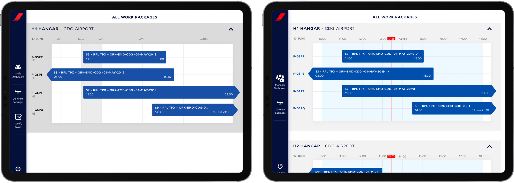
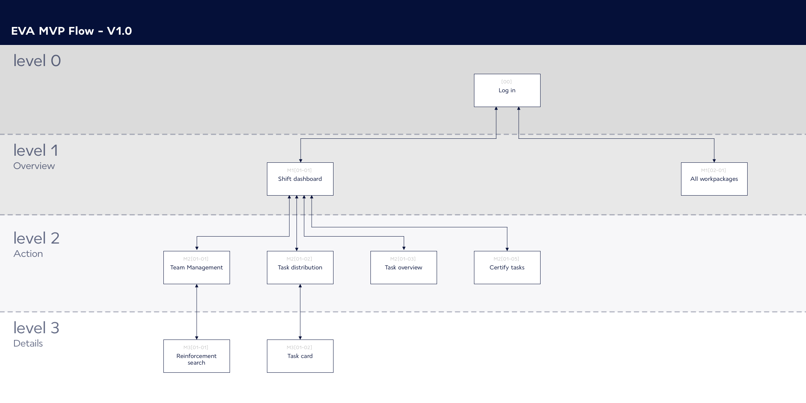
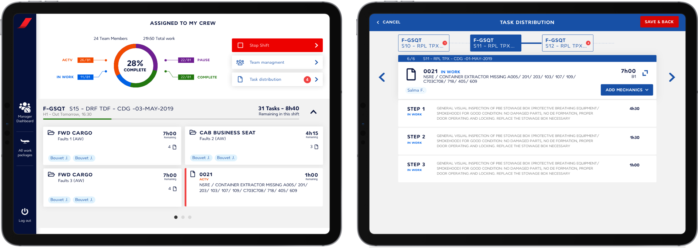

#Problem
I worked on this project while I was an interaction designer at Mirabeau, a digital agency based in the Netherlands. Mirabeau does a lot of work for airlines, one of which is Air France - KLM. Aircraft maintenance mechanics at Air France were working mostly on paper and using a very complex software program for administration. This was costing a huge amount of paper, and the administration also took a long time because the software was too complex. Every mechanic was given an iPad but still, there was nothing that was specially designed for them to allow them to work digitally. So the goal of the project was to create a digital tool called EVA to increase efficiency, employee happiness, and quality of work.

Before I joined the project, a 6-week get-ready phase took place during which a lot of user research was done to map the entire workflow and user journey. Also, a quick prototype was created to visualize the results of this research. I joined right after this was done and my task was to take the prototype and turn it into a solid MVP in 7 months.

#Process
The development was handled by KLM. We worked with one scrum team that was based at the KLM maintenance hangars at Schiphol Airport. The team consisted of an interaction designer (me), a visual designer, a product owner, 2 front end developers, a back end developer, 2 information analysts, and a business analyst.

For each screen, we would take the prototype that was created during the get-ready phase and use it as a base for the design. We then researched the functionality by doing user interviews, co-creation sessions, paper prototypes, and by creating user journeys.

After that, the visual designer and I sketched our ideas on a big whiteboard. When we came to a final design, we invited the rest of the team to give input from their expertises.

After several of these iterations, I took the final iteration and turned it into an interactive prototype on Axure. I then tested this with the end-users in the AirFrance hangars in Paris

I processed the feedback of the tests and then did another test if needed.

If no other test was needed, I worked together with the visual designer and developers to create the final design that was going to be implemented in the app.

As the only interaction designer, I lead the process of researching and designing all the different screens. I strongly advocated doing regular user tests to be able to understand the very complex process of the mechanics, and to gain the trust of the end-user.

#Challenge
The project was a big challenge from an interaction design perspective. How can you take the entire workflow of mechanics and turn it into a digital app, taking into account the higher flexibility that paper has over digital, and the openness to change of the users who have been working in a certain way for years and are now forced to change.

The biggest challenge in that regard was in aligning all the different processes of the mechanic. Air France has multiple hangars in multiple airports. And in each hangar, there is different maintenance work and teams working in different ways. All of these teams had to use the app and therefore, work in roughly the same way. Next to that, there are very strict regulations around the work so I was often limited in what I could do with the design. The way I approached this was by doing as many user tests as possible.

The prototype was created without any technical constraints and without looking too much into the future. So next to developing all the features, it was also a challenge to lay out a framework that would allow the app to grow and stay usable. Coming up with such a framework from the start is very difficult so, at the start, I first developed screens based on the prototype. When I gathered enough knowledge about the project, I worked on this framework and slowly introduced it into the design. This gradual process made sure that we did not delay the project too much and satisfied all stakeholders.

The last challenge was the fact that the developers created the app in the Ionic framework and not native iOS. This limited the freedom of the design by quite a bit since we mostly had to use the components that were offered by Ionic.

