I recently came back to the Netherlands after living abroad for a year. Upon my return, I was confronted with the NS ticket machine again. Generally, the digital products of NS look great, but the ticket machines at the railway station are a big exception. For me as an experienced user, they work fine, but the problem is that I don’t like using them. The interface is very utilitarian and looks outdated. Also, now that I am living in a touristic area, I often see people struggle with it. Therefore, last week I used my spare time to see if I could improve the user experience of the system in a 5-day design sprint.

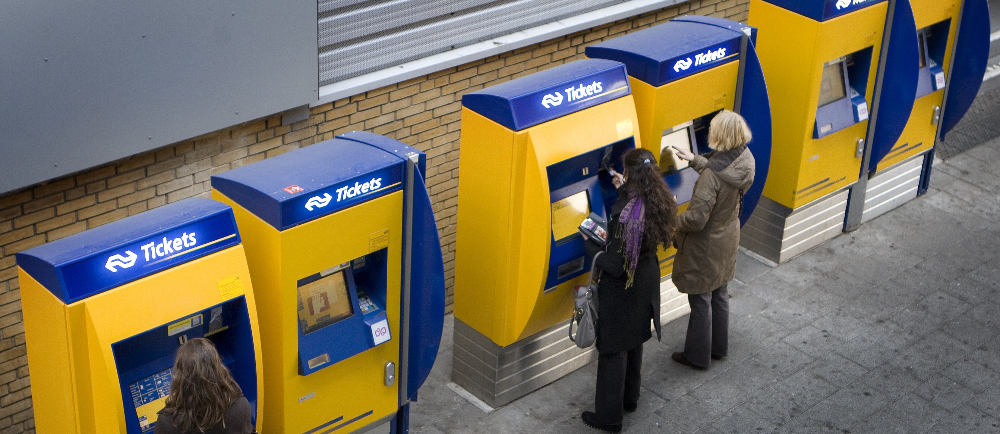

##The Current System
The NS machines are present at every train station and allow travelers to buy train tickets or recharge their public transport cards (ov cards).
The interface consists of a very basic vertical menu structure, adding a column on the right the deeper you go into the menu. It works if you know how to use it, but it looks very outdated. Also, I get the impression that new users are struggling with the system. There is a lack of information, some elements of the interface are easily overlooked, and my prediction is that people have a different mental model today, due to the modern touch interfaces they are used to.

[Check out a video of the system](https://www.youtube.com/watch?v=UnJ0EgNjT5s)

##Understanding the problem
I wanted to find out if my predictions were correct and if users encounter any other problems while using the machines. To do this, I first did an introspection to analyze the problems I find when using the system. After that, I went to Amsterdam Central Station to observe users.

###Introspection
First, I used to a machine to see for myself where the problems lay. I went through a number of use cases, writing down the problems I encountered:
* Recharge my ov card
* Load the bicycle supplement on my ov card
* See my transaction history
* Buy a train ticket to Amsterdam
* Buy an anonymous ov card

###Results
Let’s start with the good points. For people like me, who have used the machine often, the structure is not bad at all. The interface is very simple, there are no complex graphics or animations, so most interactions can be done very quickly. Also, it is easy to remember the location of the buttons on the screen so frequent actions can be learned by heart.

However, the interface assumes that people know exactly what they want to do and how to do it before using the system. For instance, the option to buy an anonymous ov card is hidden under ‘other products’ and the button for that shows an icon for each ‘other product’ except an ov card. I had never bought one before so I struggled to find it in the interface.
Also, the search function for destination stations assumes that people know how to spell each station and works based on the first letters for each station. So when trying to find Amsterdam Lelylaan, one has to type ‘AM’ after which the system hides the keyboard and shows the 14 stations that start with ‘Am’. It is not possible to find Amsterdam Lelylaan by typing ‘Lely’ which would narrow the search down much more.

It is also easy to overlook elements. Often there is extra information presented which is written underneath a button, but has to be fit inside the narrow menu. On other occasions, the text is written in a corner of the screen where you can easily miss it. For instance, information about your ov card is shown in the right top corner but your eyes are drawn to the menu options on the left.
The buttons are also quite narrow and as a result, the texts in the buttons are often abbreviated which makes it difficult for low-literate users.

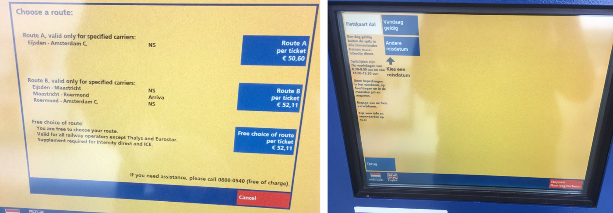

But my main complaint is that I don’t like using the system. The visuals are very basic and the machine makes a very loud sound with each button press. The interface uses only two colors, bright yellow and blue, the company colors of NS. The colors are very contrasting which is great, but as a result only the interactive blue buttons attract my attention, the other elements are hard to notice. Adding to that, the information is grouped minimally and not clustered. It took me a while to find out if I was checked in because it was a simple text on the yellow background tucked away in a corner opposite from the menu.

Another example is the route page. After selecting a destination for a single or return ticket, the interface shows the possible routes that you can take. But due to the design language, all this text is presented on a yellow background so it is visually overwhelming.
However, the screen after that, which shows the details of the ticket, looks very modern and is well designed. So that gave me the impression that they are working on a new design but haven’t implemented every screen of the interface yet.

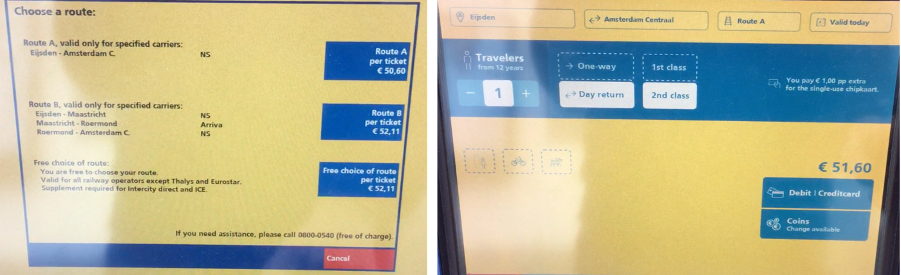

I also think that the number of steps for each action can be reduced. Especially for actions that are done often, like charging your ov card.
Clearly, the focus of the design of the ticket machine is on usability. But as a result, it stands in contrast with the well-designed website and app of the NS. It is understandable because the ticket machines have to be used by everyone, including people with zero experience with digital systems, foreigners, people with disabilities, etc. But I would like to find out if it is possible to find a balance between usability and a beautiful design.
Observing users

Next, I went to Amsterdam Central station and asked people if I could observe them while using the system. I observed 18 people, 11 of whom were experienced users, the rest were inexperienced and consisted of 5 tourists and one elderly couple.

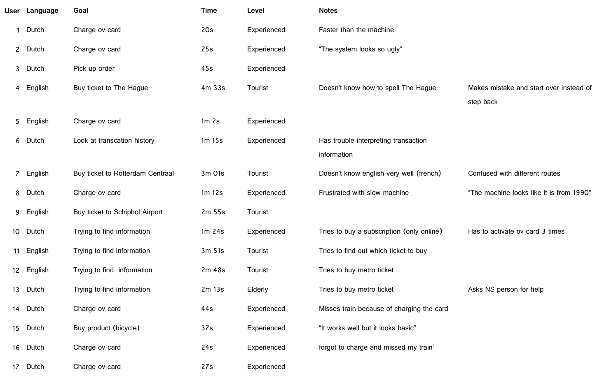

####Experienced users
As expected, most of the experienced users encountered no problems. The most occurring task was to charge the ov card. It seemed that most people were in a hurry and had done the interaction multiple times before. As a result, they knew how to do it by heart and were often frustrated that the machine was not thinking as fast.
Also, there was some confusion about what you can do online or in the app and what you can do in the machine. Last, it seems that the interface does not provide a clear button to go one step back. As a result, users were sent back to the main menu too often and had to scan their ov cards multiple times to keep going back into the ov card menu.

I asked some of the users what they thought of the system and the opinions were largely the same: the system works well but it could be faster, and it looks outdated.

####Inexperienced Users
Most tourists bought a single or return ticket or were trying to find information. Obviously, there was more confusion but overall, they could complete the tasks reasonably well.

There are some points of improvement though. First of all, the search screen for destinations is limiting. Destinations can only be found by typing the first 2 letters of the station. Which is difficult for tourists. There is a button that filters on airports, but it was always overlooked. The main menu screen has a button for travelers to Schiphol Airport which is a great help. But for other destinations, it can be challenging. For instance, there was a tourist couple that wanted to go to The Hague, but didn’t know how to spell it.

For people who used the public transport in the Netherlands for the first time, a lot of information was missing and they had to ask an employee of NS for help. The machine provides almost no information and assumes that people know what they want before accessing it. Adding to that, the only language options available are Dutch and English. The Netherlands receives a lot of visitors from France, Germany and other countries whose inhabitants don’t always speak English so these people struggle even more to use the system.

Overall, the where also some technical errors that won’t be addressed in this design sprint but are interesting nonetheless. For instance, taps sometimes didn’t register. There was visual feedback from the button that it registered a press, but no beep. In those cases, nothing happened and users had to press again. Also, NS has three different kinds of ticket machines and the visual distinction between them is too small. So new users were quite confused by that. The machines also don’t support contactless payment which makes the interactions quite long as well.

###Objective
Obviously, it is not possible to create a perfect redesign of the entire system in a week so I set myself a few goals that I wanted to achieve with this design sprint based on the observations and introspection.
1. Make the system faster for the experienced users
2. Provide more information and help for inexperienced users
3. Find a balance between a beautiful design and usability
The focus for this was only on the process of buying a ticket and charging products on an ov card since these cover most of the interactions with the machine. Other interactions were left out of this project.

##Sketches and Wireframes
With the three goals in mind, I started sketching new interfaces and workflows. I had a few ideas before starting that I wanted to implement. One of these was a button to quickly charge your ov card with a certain amount. So this button would take a user straight from the first menu to checkout. This is meant for people who quickly want to charge their card before catching a train.

Next, I wanted to reduce the number of buttons and screens, for instance by creating a single page for adding all products to your ov card, instead of having to go into separate menus for adding money and supplements respectively. Also, in the checkout screen users don’t have to press a button to choose their mode of payment.
I added clear arrows as well so that users are not thrown out of the ov card screen and have to scan again.

Next, I wanted to give the possibility to implement more information and languages for new users. So the home screen has a new information button where users can find basic help about the Dutch public transport system, and each menu item has a small help button that displays information.

Last, I improved the search function for finding railway stations. So now the search is much smarter and allows users to type any part of the name instead of the first two letters.

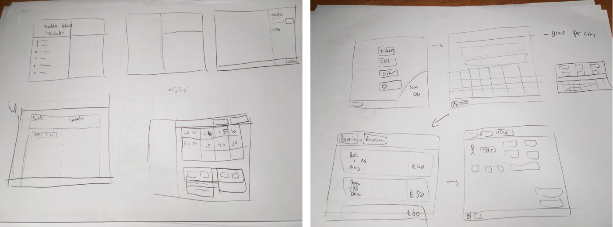

After a couple of sketches, I found my basic layout so I moved to Sketch to create wireframes.

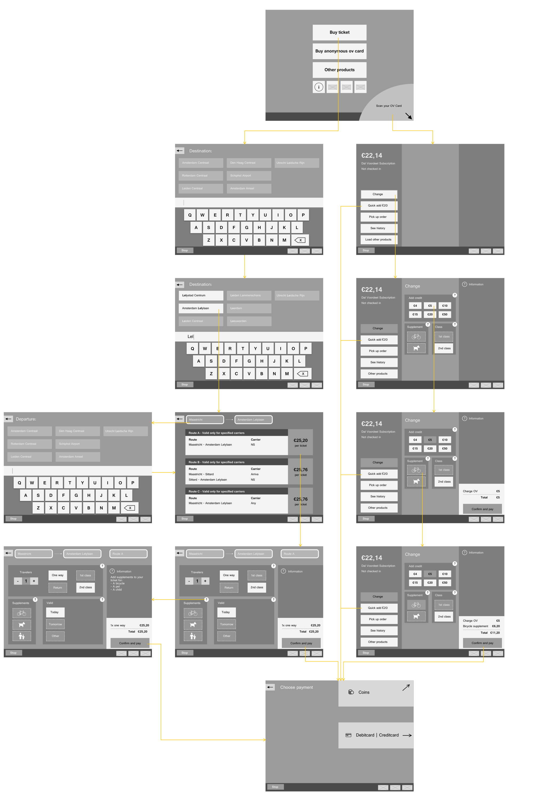

I changed the home screen so it offers one more option. I moved the option to buy an anonymous ov card outside of the menu for ‘other products’ because I would never find it in there and I observed people struggling with it. Next, I added big buttons for the languages and for an information page.

The process of buying a single ticket is quite similar but I have made some important changes. I tried to group related information together. So first, users select a destination, then a route, and then they can change variables and add supplements. At each step, I focused on making the information more readable, which is especially apparent in the screen where users have to choose a route.

In the old system, there was a clear structure with a menu bar on the left side that folded out with each step. I opted to use separate pages with clear back buttons and a representation of each step at the top. So users can always go back one step or choose the step they want to go back to.
There are some options like the date of the journey that are a bit hidden in the current system. So I wanted to create one screen with all the options so that users get a quick overview of all the options they can change. Each group of options has a button for more information.

The process of adding products to the ov card is quite different. I kept the basic layout with a menu on the left side. But each menu item opens a separate page instead of a new menu.

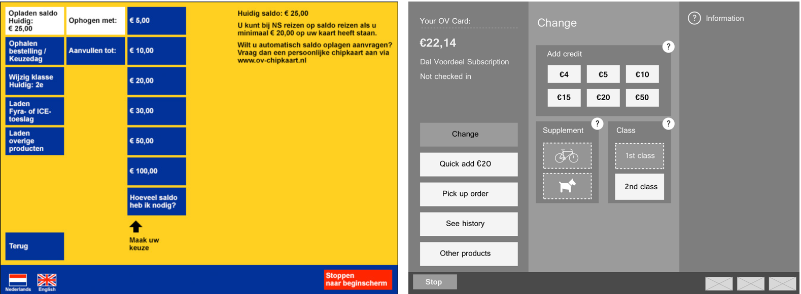

The most important characteristic of the ticket machine is that it has to be usable for every member of society. This means that people with zero experience with technology should be able to use it, as well as low literate people, people with disabilities, etc. I took some steps to ensure this.
Throughout the interface, I tried to place all buttons in the lower half of the screen to improve access for wheelchair users. I used as many icons as possible for foreign and low-literate people.
Next, I tried to find a better color scheme. The current machine uses a bright yellow background and blue buttons which is very intense. When creating my color scheme, I was inspired by the NS colors but also wanted to create a comforting look. I decided to swap the colors of the current system. According to color psychology, blue is a comforting color so I wanted a shade of blue for the background and brighter colors for interactive elements. So I included three shades of blue, including the dark NS blue, that will be used as background colors, and a shade of white and yellow that are used for interactive elements.

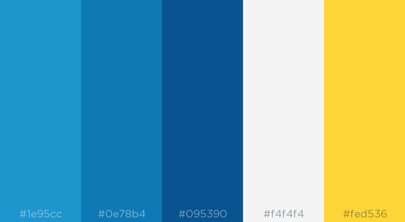

After creating the prototype, I tested the colors to see how they worked with different kinds of color blindness to make sure that the interface was readable.

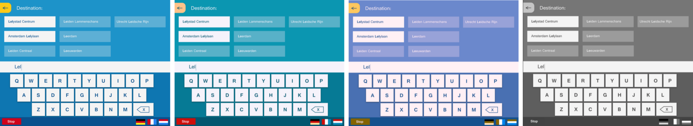

##Result
Next, I used InVision to map out 3 scenarios:
* Buying a ticket from Maastricht to Amsterdam Lelylaan + needing more information about supplements
* Charging the ov card with 5 euros and the bicycle supplement
* Quick charging the ov card with 20 euros

[Check out the prototype on InVision](https://invis.io/QAOXMN063E4#/329359068_Artboard)

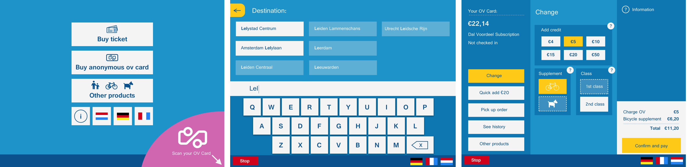

##Evaluation
I used the InVision prototype to conduct a user test with 7 users from different age groups, nationalities, and backgrounds. based on the results, I made some small changes that are already included in the new prototype. For instance, I added more icons and changed the names of certain buttons.

Obviously, the interface is far from complete but that was not the goal of the design sprint. I wanted to follow a full design cycle in 5 days to create a better user experience. I focused on the most occurring use cases: buying a train ticket and charging an ov card and I tried to achieve three goals:
1. Make the system faster for the experienced users
2. Provide more information and help for inexperienced users
3. Find a balance between a beautiful design and usability

Users reacted positively during the user test and showed that the three goals were achieved. Experienced users could add products to their ov cards much faster. New users struggled much less to find certain products. All of the users enjoyed the new interface more than the current machine.

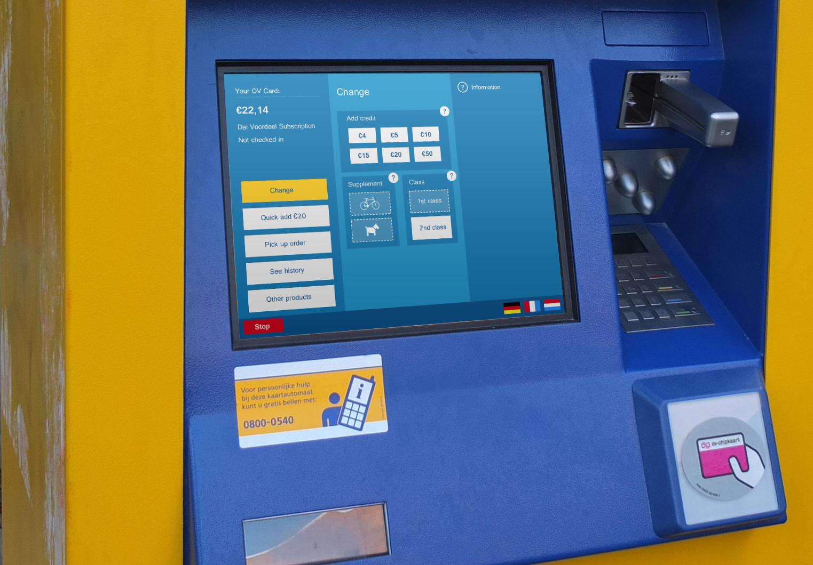

