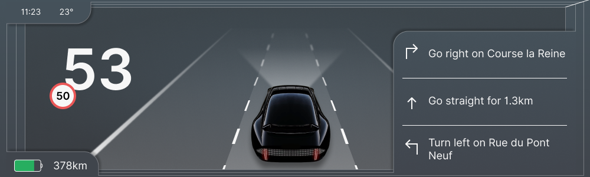
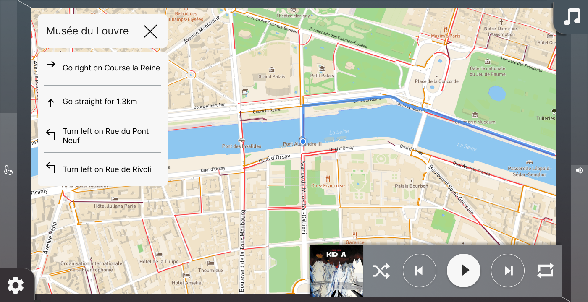
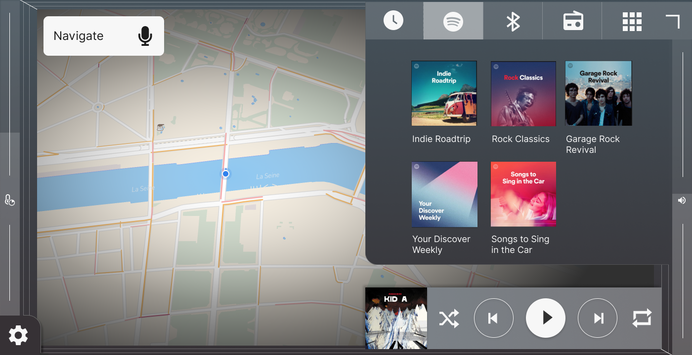
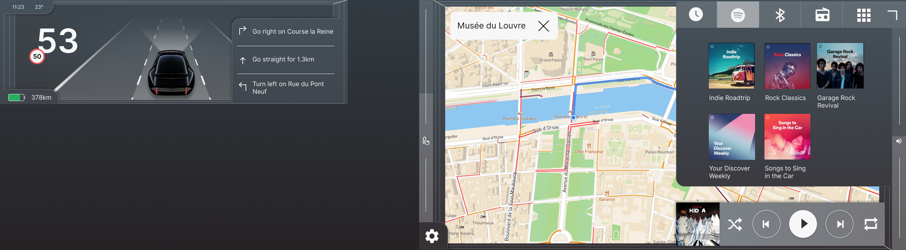
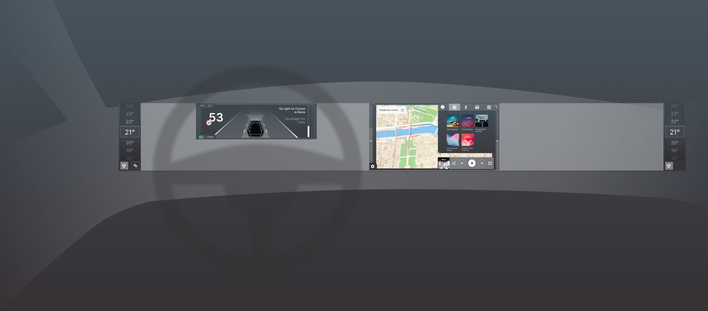

Over the past years, a trend in car design has emerged where car designers have been 'decluttering' car interiors. They are removing physical controls in favor of touch screens. The main reasons for this are the cleaner looks and cost-saving.

However, when car companies do this, they fail to take full advantage of touch screens. Instead, their approach has largely been to copy tablet interfaces, and directly convert physical buttons into touch buttons. As a result, touch interfaces in cars are difficult to use.

When looking around in traffic, the number of people being distracted by their phones and infotainment systems is alarming. The latter is a problem entirely created by the car companies themselves. I think they are not doing enough to take ownership and address this. Having a well-designed user experience does not only lead to fewer accidents, but it also leads to happier customers, it is a win-win!

In short, either touch screens are a step back in usability from physical controls and a different solution has to be found, or there are significant improvements possible in the design. I decided to see if it is possible to create an in-car experience that has no physical controls and is usable at the same time.

[Check out the full project on my blog!](https://theturnsignalblog.com/blog/new-touch-concept) 

<iframe src="https://www.youtube.com/embed/kGjDgaYGjSE" frameborder="0" allow="accelerometer; autoplay; encrypted-media; gyroscope; picture-in-picture" allowfullscreen></iframe>

